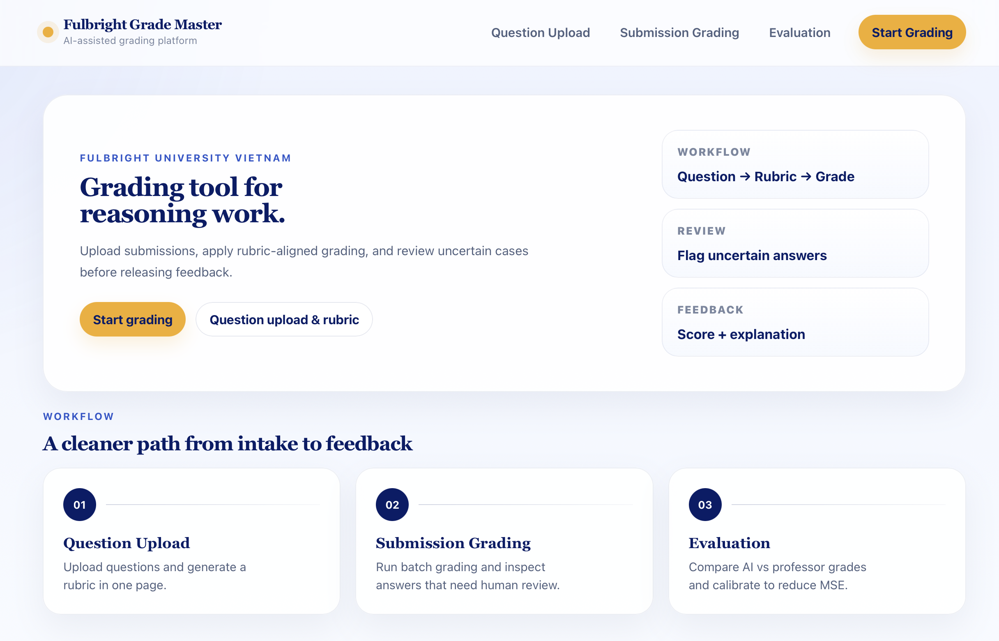

# Grading Tool

<p align="center">
  
</p>

An AI-assisted grading workbench for open-ended exam questions. It combines a Gemini-powered rubric grader with calibration, evaluation, and mistake-analysis tooling, exposed through three surfaces:

- **Python CLI** — batch grading and evaluation over benchmark datasets.
- **FastAPI backend** — HTTP API consumed by the frontend and by scripts.
- **React (Vite) frontend** — end-to-end UI: question intake → rubric generation/revision → submission grading → evaluation.

## Repository layout

```
app/                FastAPI backend (routes, schemas, services)
src/grading_tool/   Core library
  grading/          Orchestrator, prompt builder, rubric grader/generator/reviser,
                    response parser, mistake analyzer, survey reviewer,
                    question-type router
  evaluation/       Agreement, metrics, calibration, error analysis, reports
  models/           Gemini client wrapper
  schemas/          Pydantic schemas for benchmark + results
  cli/              `grade` and `evaluate` entry points
configs/            base.yaml, prompts.yaml, scoring.yaml
data/
  benchmarks/       cs302 midterm1, midterm2, final (fall 2025), synthesis, econ
  outputs/          runs/, reports/, calibration/
frontend/           React 19 + Vite + TypeScript UI
scripts/            run_calibration.py and helper data scripts
tests/              pytest suite + reference run/eval fixtures
docs/               API.md, DATA_FORMATS.md, DEVELOPMENT.MD,
                    GETTING_STARTED.MD, ARCHITECTURE_DIAGRAM.md, REPO_NOTES.md
```
More details in `FOLDER_STRUCTURE.md`

## Quickstart

### 1) Python setup

```bash
python -m venv .venv
source .venv/bin/activate
pip install -e .
```

`pyproject.toml` already pins FastAPI, Uvicorn, Pydantic, pandas, PyYAML, tqdm, pytest, python-dotenv, streamlit, and `google-generativeai` — no extra install needed for the CLI or API.

### 2) Configure API

Create `.env` at the repo root:

```bash
API_KEY=your_key_here
MODEL=your_chosen_model_here
```

`.env` is loaded automatically via `python-dotenv`.

### 3) Run CLI grading + evaluation

Grade a benchmark:

```bash
python -m src.grading_tool.cli.grade \
    --benchmark_dir data/benchmarks/cs302_final_fall2025 \
    --output_path data/outputs/runs/final_prompt_v3.json \
    --run_name final_prompt_v3 \
    --prompt_name prompt_v3
```

Evaluate the run against professor grades:

```bash
python -m src.grading_tool.cli.evaluate \
    --run_path data/outputs/runs/final_prompt_v3.json \
    --professor_grade_path data/benchmarks/cs302_final_fall2025/final_professor_grade.json \
    --output_path data/outputs/reports/final_prompt_v3_eval.json
```

Useful grading flags:

- `--question_ids q7 q8` — restrict to specific questions
- `--limit_students N` / `--limit_questions N` — smoke-test slices
- `--model_name gemini-2.5-pro` — override the Gemini model
- `--prompt_name prompt_v1|prompt_v2|prompt_v3` — pick a strategy from `configs/prompts.yaml`
- `--manifest_path …/benchmark_manifest.json` — non-default manifest location

### 4) Run rubric calibration (CLI)

`scripts/run_calibration.py` runs the iterative grade → diagnose → revise-rubric loop without booting the API:

```bash
python scripts/run_calibration.py \
    --benchmark data/benchmarks/cs302_midterm1_fall2025 \
    --question_id q3 \
    --max_rounds 5 \
    --output data/outputs/calibration/q3.json
```

## Running the API (FastAPI)

```bash
uvicorn app.main:app --reload --port 8000
```

Implemented endpoints (see `app/routes/`):

**Health / metadata**
- `GET /api/health`
- `GET /api/runs`
- `GET /api/evaluation/health`

**Grading**
- `POST /api/grade` — score a single answer
- `POST /api/grade-batch` — score many answers
- `POST /api/survey-submissions` — bulk survey/review pass
- `POST /api/mistake-stats` — aggregate mistake patterns
- `POST /api/generate-rubric` — draft a rubric from a question + reference solution
- `POST /api/revise-rubric` — apply manual rubric edits
- `POST /api/revise-rubric-llm` — let the LLM revise a rubric from feedback

**Evaluation**
- `POST /api/evaluation/run` — compare AI grades to professor ground truth
- `POST /api/evaluation/calibrate` — multi-round rubric calibration loop

The backend wires into the same `src/grading_tool` core, so API and CLI share the rubric grader, prompt builder, and evaluation metrics.

CORS allows local Vite (`5173`, `5174`, `4173`), LAN/private IP ranges on those ports, and the deployed Vercel frontends (`grading-tool-beige.vercel.app`, `grading-tool-ruby.vercel.app`).

## Running the frontend

```bash
cd frontend
npm install
npm run dev
```

Stack: React 19, React Router 7, TypeScript, Vite 8, with `jspdf` + `jspdf-autotable` for report export.

Point the UI at a backend with:

```bash
VITE_API_BASE_URL=http://localhost:8000
```

Pages (`frontend/src/pages/`):

- `HomePage.tsx` — landing + demo data loader
- `QuestionIntakePage.tsx` — paste/upload questions, generate and refine rubrics
- `SubmissionGradingPage.tsx` — run grading on student submissions
- `EvaluationPage.tsx` — compare against ground truth, view calibration results

State is persisted in `localStorage` (saved questions, rubrics, grading results) so the three pages compose into one workflow.

## Configuration

`configs/prompts.yaml` defines the grading prompt strategies:

- `prompt_v1` — strict, rubric-only
- `prompt_v2` — balanced, reference-aware
- `prompt_v3` — current default for the CS302 benchmarks

`configs/base.yaml` and `configs/scoring.yaml` hold pipeline defaults and scoring thresholds.

## Benchmarks and data

`data/benchmarks/` contains the canonical exam sets used during development:

- `cs302_midterm1_fall2025`
- `cs302_midterm2_fall2025`
- `cs302_final_fall2025`
- `synthesis` — small synthetic benchmark used in tests
-  Economics questions under `data/econ/`

Per-benchmark layout, professor grade format, and run/report schemas are documented in [`docs/DATA_FORMATS.md`](docs/DATA_FORMATS.md).

Grading runs are written to `data/outputs/runs/`, evaluation reports to `data/outputs/reports/`, and calibration artifacts to `data/outputs/calibration/`. These folders will be created once the program finished running.

## Tests

```bash
pytest
```

Covers loader behavior (`test_loader.py`), aggregation (`test_aggregation.py`), evaluation metrics (`test_evaluation_metrics.py`), and the rubric grader response schema (`test_rubric_grader_schema.py`). Fixture runs/reports live alongside the tests.

## Further reading

- [`docs/GETTING_STARTED.MD`](docs/GETTING_STARTED.MD): end-to-end first run
- [`docs/API.md`](docs/API.md): request/response shapes for every endpoint
- [`docs/DATA_FORMATS.md`](docs/DATA_FORMATS.md): benchmark, run, and report schemas
- [`docs/DEVELOPMENT.MD`](docs/DEVELOPMENT.MD): local dev workflow
- [`docs/ARCHITECTURE_DIAGRAM.md`](docs/ARCHITECTURE_DIAGRAM.md): component relationships
- [`docs/CALIBRATION.md`](CALIBRATION.md): calibration logic design
