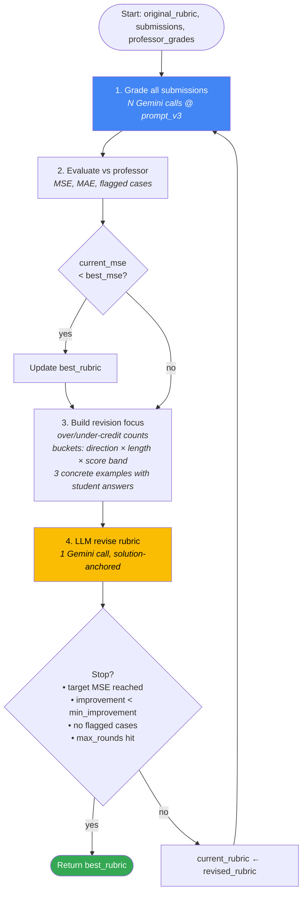
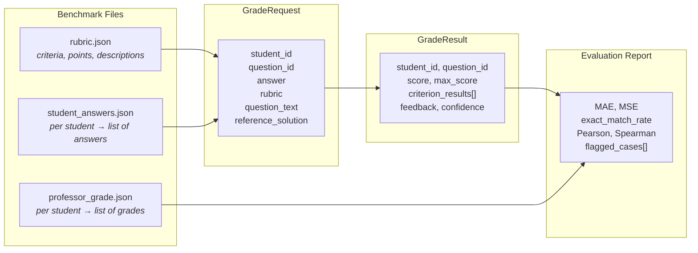

# Architecture Diagrams (Mermaid)

Two views: (1) high-level pipeline, (2) calibration loop detail.
Paste into Notion, Google Slides (via Mermaid Live), GitHub README, or any Mermaid renderer.

---

## 1. High-Level Pipeline

```mermaid
flowchart TB
    subgraph IN["📥 Input Layer"]
        Q[question.json]
        R[rubric.json]
        S[solution.json]
        A[student_answers.json]
        P[professor_grade.json]
    end

    subgraph GRADE["🤖 Grading Pipeline"]
        ORCH[Orchestrator]
        ROUTER[QuestionTypeRouter<br/><i>route by benchmark_type</i>]
        PB[PromptBuilder<br/><i>v1 strict | v2 balanced | v3 professor-aligned</i>]
        RG[RubricGrader]
        GC[GeminiClient<br/><i>temp=0, top_k=1, JSON mode</i>]
        GEM[(Gemini 2.5 Pro)]
    end

    OUT["📤 run.json<br/>per (student × question):<br/>score, criterion_results, feedback, confidence"]

    subgraph EVAL["📊 Evaluation"]
        M[metrics.py<br/>MAE · MSE · Pearson · Spearman · ExactMatch]
        REPORT["eval report JSON"]
    end

    subgraph CALIB["🔁 Calibration Loop"]
        LOOP[run_calibration<br/>round 1..N]
        FOCUS[_build_revision_focus<br/><i>bucketed disagreements + answer excerpts</i>]
        REV[RubricGenerator.revise<br/><i>solution-anchored rubric</i>]
        BEST[best_rubric<br/><i>lowest MSE round wins</i>]
    end

    subgraph UI["🖥️ Frontend"]
        QI[QuestionIntakePage]
        SG[SubmissionGradingPage]
        EV[EvaluationPage]
    end

    Q --> ORCH
    R --> ORCH
    S --> ORCH
    A --> ORCH
    ORCH --> ROUTER --> PB --> RG --> GC --> GEM
    GEM --> OUT
    OUT --> EVAL
    OUT --> CALIB
    P --> EVAL
    P --> CALIB
    M --> REPORT
    LOOP --> FOCUS --> REV --> LOOP
    LOOP --> BEST
    UI -.HTTP.-> ORCH

    style GEM fill:#4285F4,color:#fff
    style BEST fill:#34A853,color:#fff
    style REPORT fill:#34A853,color:#fff
```

---

## 2. Calibration Loop Detail



---

## 3. Data Schema Flow



---

## Quick render

- **VS Code**: install the "Markdown Preview Mermaid Support" extension, open this file, ⌘+K V.
- **Online**: paste any block into [mermaid.live](https://mermaid.live).
- **GitHub**: renders inline automatically when committed.
- **Slides export**: mermaid.live → "Actions" → Export PNG/SVG.
